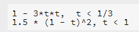

# Metaball Density funstions

## Blinn

* Always puts a sphere at the blob center, even if the weight is less than 1.0
* The fastest and most stable of all the models.

## Wyvill

* The Wyvill and Elendt models are very similar. Only the weight distribution function is different.

## Elendt

* The fastest method, but the simplest approximation, so it may not be as smooth as other functions in terms of weight distribution.

## Links

> 

* A piecewise polynomial.

## Hart

> 
